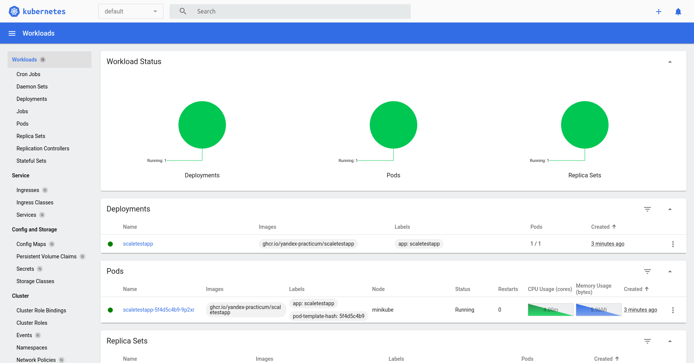
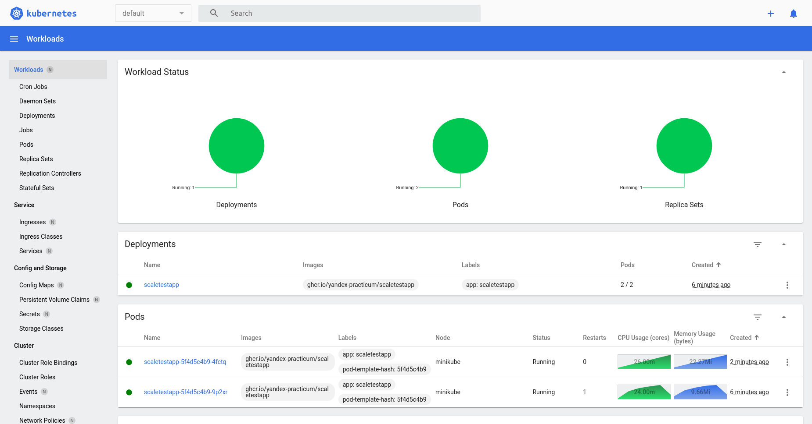
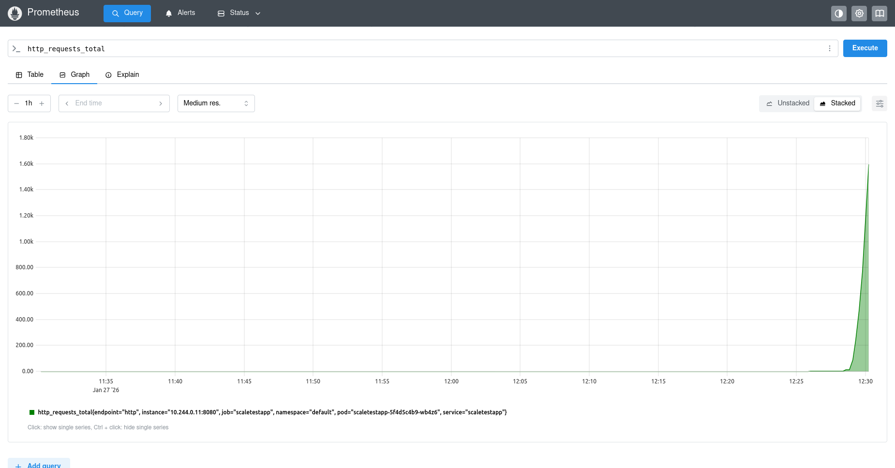
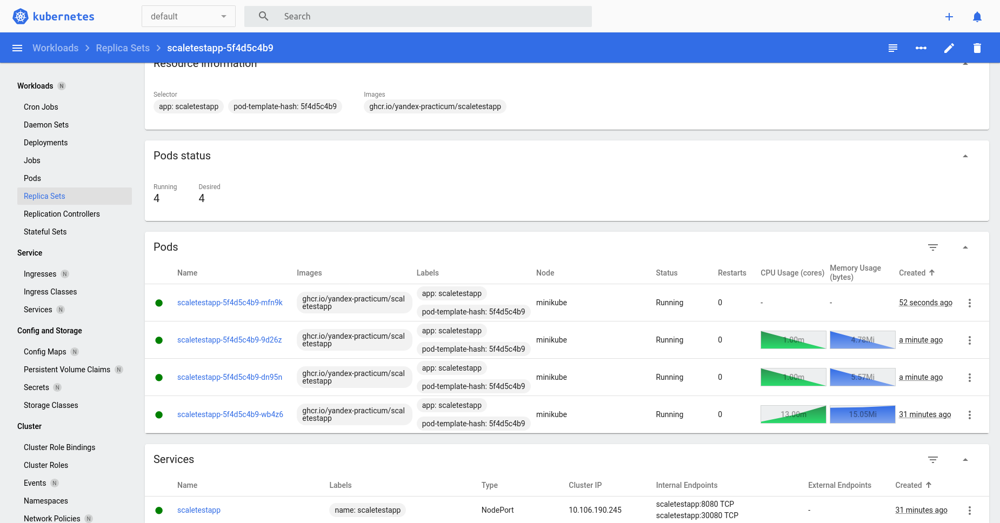

# Задание 2. Динамическое масштабирование контейнеров

## Часть 1

[Скриншот до утилизации памяти больше 80%](./screenshots/screenshot-1.png)

[Скриншот после утилизации памяти больше 80%](./screenshots/screenshot-2.png)

## Часть 2

[Скриншот интерфейса с метриками](./screenshots/screenshot-3.png)

[Скриншот после превышения 10 RPS](./screenshots/screenshot-4.png)

